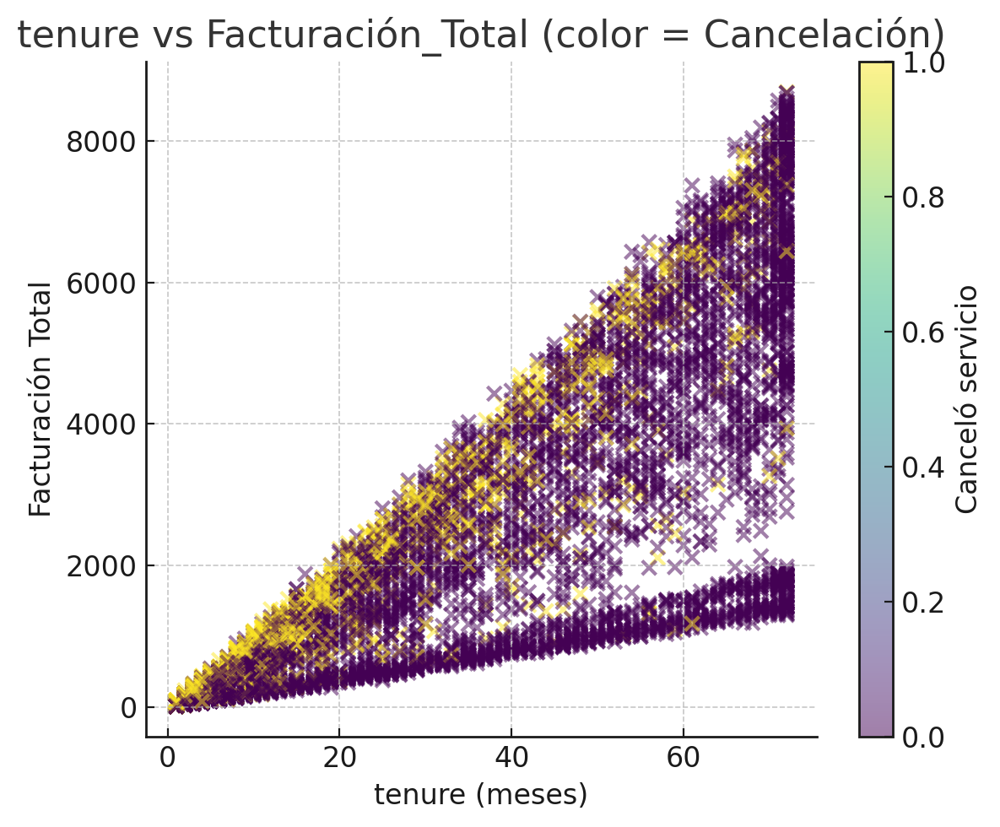

# Informe técnico – Predicción de churn en Telecom X
**Autor:** Renzo Echevarria  
**Programa:** Especialización en Data Science – Alura Latam  
**Repositorio:** `telecom-x-churn-prediction`

## 0. Resumen ejecutivo
Se construyó un pipeline de Machine Learning para predecir la cancelación de clientes (churn). Se realizó EDA, selección de variables,
modelado con Regresión Logística y Random Forest, evaluación con métricas y visualizaciones, e interpretación de variables.

Resultados clave:
- Proporción de churn en los datos: **26.54%**.
- Mejor discriminación en test: **Regresión Logística** con **ROC AUC = 0.843** (Random Forest **0.824**).
- Variables recurrentes: **tenure**, **facturación total/mensual/diaria**, **tipo de contrato**, **InternetService (Fiber optic)** y **método de pago (Electronic check)**.

---

## 1. Datos
- **Fuente:** `data/datos_tratados_telecom.csv`.
- **Variable objetivo:** `CanceloServicio` (0 = No, 1 = Sí).

Pasos iniciales:
1. Carga del CSV tratado.
2. Eliminación de identificadores irrelevantes (p. ej. `customerID`).
3. Limpieza de filas con objetivo nulo y conversión a entero.

---

## 2. Preparación y EDA
### 2.1 Proporción de churn


### 2.2 Correlación con la variable objetivo
Se codificaron las categóricas vía One‑Hot Encoding (`drop_first=True`) y se calcularon correlaciones con `CanceloServicio`.


### 2.3 Análisis dirigido
- **tenure vs cancelación**  
  

- **Facturación Total vs cancelación**  
  

- **tenure vs Facturación_Total (color = cancelación)**  
  

---

## 3. Preparación para modelado
- **Codificación:** One‑Hot Encoding.
- **Partición:** `train_test_split` 80/20 estratificado (`random_state=42`).
- **Imputación:** `SimpleImputer(strategy="median")`.
- **Escalado:** `StandardScaler` para Regresión Logística.

---

## 4. Modelos
### 4.1 Regresión Logística
Pipeline con imputación + escalado + `LogisticRegression(max_iter=1000, random_state=42)`.

### 4.2 Random Forest
Pipeline con imputación + `RandomForestClassifier(random_state=42)`.

---

## 5. Evaluación (conjunto de prueba)
### 5.1 Métricas
| Modelo               | Accuracy | Precision | Recall | F1   | ROC AUC |
|----------------------|---------:|----------:|-------:|-----:|--------:|
| Regresión Logística  | 0.794 | 0.637 | 0.521 | 0.574 | **0.843** |
| Random Forest        | 0.792  | 0.644  | 0.484  | 0.553  | 0.824  |

> Métricas sobre la clase positiva (1 = cancela) con umbral 0.5.

### 5.2 Matrices de confusión
- **Regresión Logística**: `TN=924, FP=111, FN=179, TP=195`  
  

- **Random Forest**: `TN=935, FP=100, FN=193, TP=181`  
  

### 5.3 Curvas ROC


Conclusión: en esta configuración base, la **Regresión Logística** muestra mejor discriminación que Random Forest.

---

## 6. Importancia y explicación de variables
Se comparó la magnitud de coeficientes de la logística (valor absoluto) con la importancia de Random Forest y se armó un ranking combinado.


**Top 15 variables (ranking combinado):**
1. `tenure`
2. `Facturacion_Total`
3. `Facturacion_Mensual`
4. `Facturacion_Diaria`
5. `TipoContrato_Two year`
6. `InternetService_Fiber optic`
7. `InternetService_No`
8. `TipoContrato_One year`
9. `MetodoPago_Electronic check`
10. `FacturacionElectronica`
11. `LineasMultiples`
12. `SoporteTecnico`
13. `TVStreaming`
14. `SeguridadOnline`
15. `PeliculasStreaming`

Notas:
- La interpretación de dummies es **respecto a la categoría base** del One‑Hot.
- Evitar inferir causalidad: hablamos de **asociaciones**.

---

## 7. Recomendaciones
1. **Retención temprana (0–6 meses):** campañas y beneficios para clientes de tenure bajo.  
2. **Migración a contratos más largos:** incentivos para pasar de mensual a One/Two year.  
3. **Pagos:** reducir fricción de **Electronic check** y promover pagos automáticos.  
4. **Segmentación por servicio:** reforzar valor percibido en **fiber optic**.  

---

## 8. Reproducibilidad
- Python 3.9+, `pandas`, `numpy`, `scikit-learn`, `matplotlib` (y `seaborn` opcional).  
- `train_test_split(test_size=0.2, stratify=y, random_state=42)`; `SimpleImputer(median)`; `StandardScaler` en logística.

Estructura sugerida:
```
informe/
├─ informe.md
└─ img/
   ├─ fig1_proporcion_churn.png
   ├─ fig2_top15_corr.png
   ├─ fig3_box_tenure.png
   ├─ fig4_box_fact_total.png
   ├─ fig5_scatter_tenure_fact.png
   ├─ fig6_cm_log.png
   ├─ fig7_cm_rf.png
   ├─ fig8_roc.png
   └─ fig9_importancias.png
```

---

## 9. Limitaciones y siguientes pasos
- Ajuste de hiperparámetros (Grid/Random Search) y validación cruzada.  
- Optimización del **umbral de decisión** con curva Precision‑Recall y matriz de costes.  
- Explainability local con **SHAP**.  
- Evaluación temporal si aplica.

---

## 10. Conclusión
La **Regresión Logística** logra **ROC AUC = 0.843** en test con señales claras: **tenure**, **facturación**, **tipo de contrato**, **fiber optic** y **método de pago**.
Se recomiendan acciones de retención enfocadas en clientes recientes, de baja facturación y contrato mensual.
